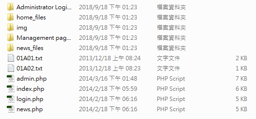

# 整理檔案

## 重新命名檔案

- `01P01.htm` 改為 `login.php`
- `01P02.htm` 改為 `index.php`
- `01P03.htm` 改為 `admin.php`
- `01P04.htm` 改為 `news.php`

## 新增圖片資料夾

`Management page_files` 這個資料夾裡多了一個 `icon`資料夾，把它複製到其他資料夾裡。  
當然也可以修改網頁檔內的css路徑，只是會比較花時間。

建立img資料夾，把圖片都放進去。

