# 建立資料庫

這題資料庫結構都非常相似
可以用 `CREATE TABLE tb2 LIKE tb1` 這個指令快速複製一樣結構的資料表，或是從phpmyadmin資料表的操作功能複製資料表  

## 小技巧
- 以後台管理頁選單裡各管理項目的redo來當資料表名稱  
- 將資料表欄位取的有規律，文字叫text，檔案叫file，顯示叫display
- 由於是應付考試，欄位型態不用特別用`varchar`優化，一律用`text`就好
- 在製作後台頁面時，以欄位的名稱來當input標籤的name，就可以直接用foreach迴圈跑UPDATE語法，節省程式碼量

## 管理員

新增admin資料表，儲存管理員帳號密碼  
id為AUTO\_INCREMENT的流水號，acc為帳號，pass為密碼  
在建立資料表時順便新增預設管理員，帳號admin，密碼1234

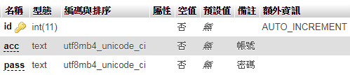

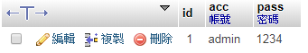

## 跑馬燈廣告

新增ad資料表，儲存跑馬燈廣告  
id為AUTO\_INCREMENT的流水號，text為文字，display為是否顯示  
在建立資料表時順便新增01A02.txt裡的5個預設跑馬燈文字

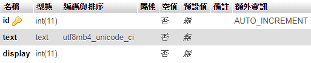

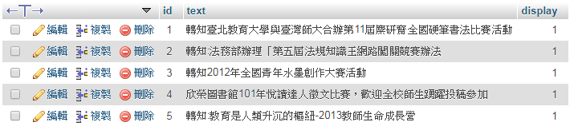

## 動畫輪播

新增mvim資料表，儲存首頁動畫  
id為AUTO\_INCREMENT的流水號，file為檔名，display為是否顯示  
在建立資料表時順便新增六個圖片輪播檔案

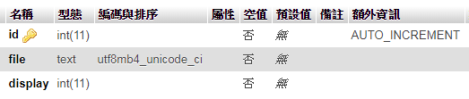

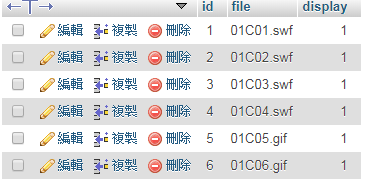

## 校園映像

新增image資料表，儲存校園映像  
id為AUTO\_INCREMENT的流水號，file為檔名，display為是否顯示  
在建立資料表時順便新增01D01.jpg~01D10.jpg 

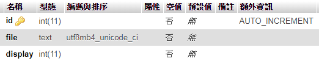

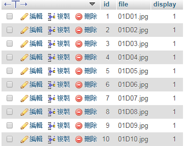

## 最新消息

新增news資料表，儲存最新消息  
id為AUTO\_INCREMENT的流水號，text為文字，display為是否顯示  
在建立資料表時順便新增01A02.txt裡的最新消息

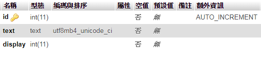

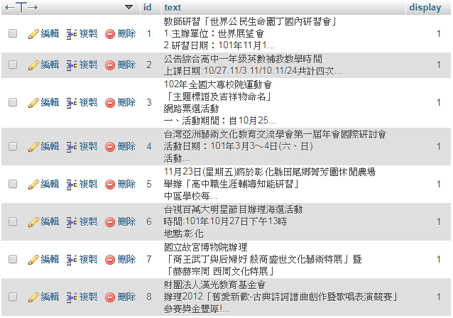

## 標題圖片

新增title資料表，儲存banner  
id為AUTO\_INCREMENT的流水號，text為文字，display為是否顯示，**display只能有一個為1**   
在建立資料表時順便新增01B01.jpg~01B04.jpg

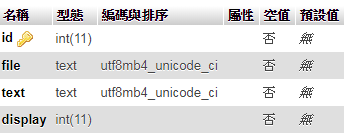

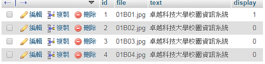

## 選單

新增menu資料表，儲存選單  
id為AUTO\_INCREMENT的流水號，text為選單文字，href為選單超連結，display為是否顯示   
parent為上層選單id，0為最上層選單 

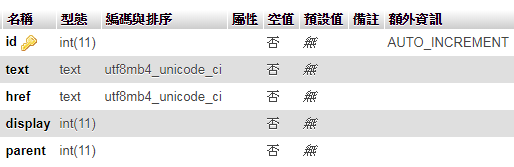

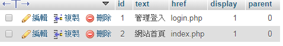

## 訪客人數

新增total資料表，儲存訪客人數  
count為訪客人數  
在建立資料表時順便新增一筆為0的資料 

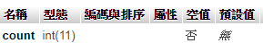

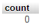

## 頁尾版權

新增bottom資料表，儲存頁尾版權文字   
text為版權文字  
在建立資料表時順便新增一筆資料

